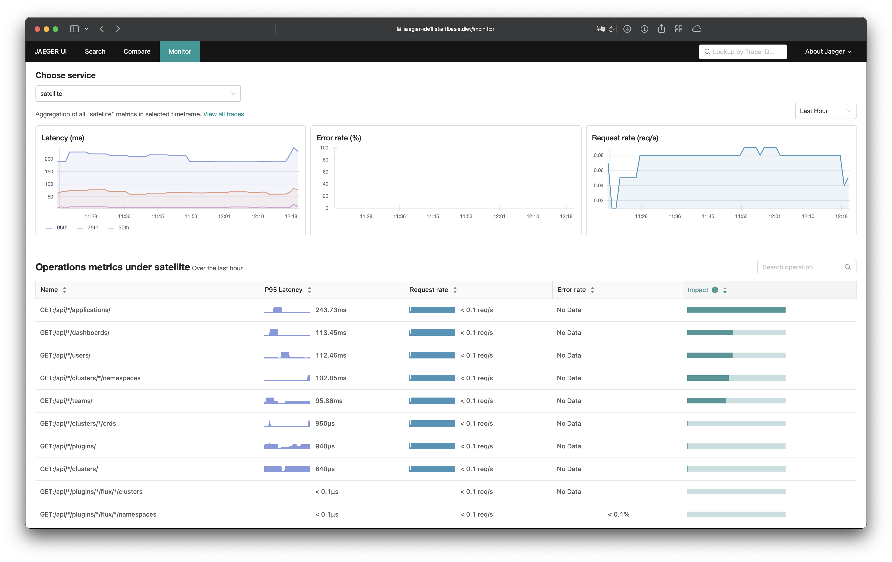

# Jaeger Exporter

The **Jaeger Exporter** creates the Prometheus metrics for the
[Service Performance Monitoring](https://www.jaegertracing.io/docs/1.37/spm/).

The exporter reuses the Jaeger Ingester logic to consume spans from a particular
Kafka topic, but instead of writing them to a storage backend it creates the
metrics `calls_total` and `duration_milliseconds` for the Service Performance
Monitoring. To use these metrics the `--prometheus.query.normalize-calls` and
`--prometheus.query.normalize-duration` flag must be set for Jaeger.



## Installation

The Jaeger Exporter can be installed via [Helm](https://helm.sh/) or
[Kustomize](https://kustomize.io).

To install the exporter via Helm you can use the following commands:

```sh
helm upgrade --install jaeger-exporter oci://ghcr.io/ricoberger/charts/jaeger-exporter --version <VERSION>
```

## Configuration

The Jaeger Exporter can be configured via command line flags. The following
flags are available:

```
--exporter.address string                  The address where the exporter is listen on. (default ":8080")
--exporter.deadlockInterval duration       Interval to check for deadlocks. If no messages gets processed in given time, exporter app will exit. Value of 0 disables deadlock check.
--exporter.parallelism int                 The number of messages to process in parallel. (default 1000)
--exporter.services string                 A comma serperated list of services for which the metrics should be generated (e.g. "service1,service2,service3"). If empty, the metrics are generated for all services.
--kafka.consumer.brokers string            The comma-separated list of kafka brokers. i.e. "127.0.0.1:9092,0.0.0:1234" (default "127.0.0.1:9092")
--kafka.consumer.client-id string          The Consumer Client ID that exporter will use. (default "jaeger-exporter")
--kafka.consumer.encoding string           The encoding of spans ("json", "protobuf", "zipkin-thrift") consumed from kafka. (default "protobuf")
--kafka.consumer.group-id string           The Consumer Group that exporter will be consuming on behalf of. (default "jaeger-exporter")
--kafka.consumer.protocol-version string   Kafka protocol version - must be supported by kafka server.
--kafka.consumer.rack-id string            Rack identifier for this client. This can be any string value which indicates where this client is located. It corresponds with the broker config broker.rack.
--kafka.consumer.topic string              The name of the kafka topic to consume from. (default "jaeger-spans")
--log.format string                        Set the output format of the logs. Must be "console" or "json". (default "console")
--log.level string                         Set the log level. Must be "debug", "info", "warn", "error", "fatal" or "panic". (default "info")
--version                                  Print version information.
```
